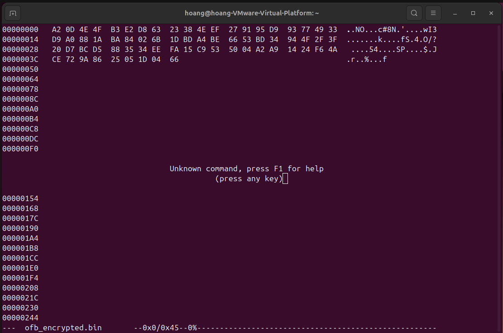
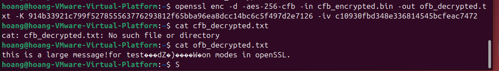
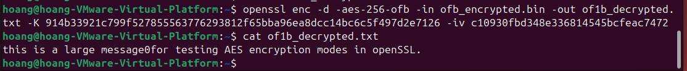

# Lab #2, 20110370, Phung Huy Hoang, INSE331280E_02FIE

# Task 1: Public-Key Based Authentication

This Lab aims to implement public-key based authentication using OpenSSL. The task involves exchanging a challenge message between the client and the server while ensuring authentication using RSA keys.

---

**Question 1**:  
- Implement the public-key based authentication according to the following scheme:
  1. The server generates a challenge message and encrypts it with the client's public key.
  2. The client decrypts the challenge message using its private key.
  3. The client signs the decrypted challenge message with its private key.
  4. The server verifies the signature using the client's public key.

Write step-by-step instructions for each part of the implementation.

---

**Answer 1**:  

## Set up:
- Use vmware to create 2 virtual machines running the ubuntu operating system

<br>

## Step 1: Generate RSA Keys for Client  

1. **Generate the private key for the client**:  
   Run the following command on the client machine to generate a 2048-bit private key:  
   ```sh
   openssl genrsa -out client_private.pem 2048
   ```  
   - Output: `client_private.pem` (client's private key).

   <br>

2. **Generate the public key for the client**:  
   Use the private key to derive the public key:  
   ```sh
   openssl rsa -in client_private.pem -pubout -out client_public.pem
   ```  
   - Output: `client_public.pem` (client's public key).

    <br>

## Step 2: Server Creates and Encrypts the Challenge Message  

1. **Create the challenge message**:  
   Create a plaintext file with the challenge message:  
   ```sh
   echo "This is a challenge message. the message is 12021" > challenge.txt
   ```  

   <br>

2. **Encrypt the challenge message with the client's public key**:  
   Encrypt the challenge message to ensure only the client can decrypt it:  
   ```sh
   openssl pkeyutl -encrypt -inkey client_public.pem -pubin -in challenge.txt -out challenge.enc
   ```  
   - Input: `client_public.pem`, `challenge.txt`.  
   - Output: `challenge.enc` (encrypted message).  

   <br>

3. **Send `challenge.enc` to the client.**

    Check the client-side IP address: 

    ```sh
    ip a
    ```

    <br> 

    Send file challenge.enc and client_private.pem to client use `scp`

    ```sh
    scp challenge.enc hoang@192.168.202.255:~
    ``` 

    <br> 
---

## Step 3: Client Decrypts the Challenge Message  

1. **Decrypt the challenge message with the client's private key**:  
   The client uses its private key to decrypt the challenge message:  
   ```sh
   openssl rsautl -decrypt -inkey client_private.pem -in challenge.enc -out decrypted_challenge.txt
   ```  
   - Input: `client_private.pem`, `challenge.enc`.  
   - Output: `decrypted_challenge.txt` (plaintext challenge). 

   <br>  

---

## Step 4: Client Signs the Challenge Message  

1. **Sign the decrypted challenge message**:  
   The client signs the decrypted message to verify its identity:  
   ```sh
   openssl dgst -sha256 -sign client_private.pem -out signed_challenge.sig decrypted_challenge.txt
   ```  
   - Input: `client_private.pem`, `decrypted_challenge.txt`.  
   - Output: `signed_challenge.sig` (signature).  

   <br> 

2. **Send `signed_challenge.sig` to the server.**

    check server ip

    ```sh
    ip a
    ```

    <br> 

    send file signed_challenge.sig and decrypted_challenge.txt to server

    ```sh
    scp signed_challenge.sig hoang@192.168.202.129:~
    ```

    <br> 

## Step 5: Server Verifies the Signature  

1. **Verify the signature using the client's public key**:  
   The server verifies the signature to ensure it matches the original message:  
   ```sh
   openssl dgst -sha256 -verify client_public.pem -signature signed_challenge.sig decrypted_challenge.txt
   ```  
   - Input: `client_public.pem`, `signed_challenge.sig`, `decrypted_challenge.txt`.  

   - Output:  
     - If the signature is valid:  
       ```
       Verified OK
       ```  
     - If the signature is invalid:  
       ```
       Verification Failure
       ```

       <br> 

---

**Explanation**:  
- **Why encrypt the challenge message with the client's public key?**  
  To ensure that only the client (with the corresponding private key) can decrypt it.

- **Why sign the decrypted message?**  
  To authenticate the client and prove that the message originated from them.

- **Why verify the signature?**  
  To validate the authenticity of the signed message and ensure it hasn't been tampered with.

# Task 2: Encrypting large message
This task explores encryption of large files using the AES-256 cipher in CFB and OFB modes. We will evaluate error propagation and chaining dependencies by analyzing the effects of modifying ciphertext.

---

## **Question 1**:  
Encrypt a file with the AES-256 cipher in CFB and OFB modes. How do you evaluate both ciphers as far as error propagation and adjacent plaintext blocks are concerned?  

### **Steps to Solve**:  

### **1. Create a text file (at least 56 bytes):**
```bash
echo "This is a large message for testing AES encryption modes in OpenSSL." > large_message.txt
```

<br> 

### **2. Encrypt the file in AES-256-CFB mode:**
Generate a key and initialization vector (IV):  
```bash
openssl rand -out key.bin 32  # Generate a 256-bit (32-byte) key
openssl rand -out iv.bin 16   # Generate a 128-bit (16-byte) IV
```

Encrypt using CFB mode:
```bash
openssl enc -aes-256-cfb -in large_message.txt -out cfb_encrypted.bin -K $(xxd -p key.bin) -iv $(xxd -p iv.bin)
```

<br> 


### **3. Encrypt the file in AES-256-OFB mode:**
Encrypt using OFB mode:
```bash
openssl enc -aes-256-ofb -in large_message.txt -out ofb_encrypted.bin -K $(xxd -p key.bin) -iv $(xxd -p iv.bin)
```

<br> 

### **Evaluation of CFB and OFB Modes:**
- **Error Propagation:**
  - In **CFB mode**, a single bit error in the ciphertext affects only the corresponding plaintext block and subsequent blocks due to feedback dependency.
  - In **OFB mode**, a single bit error in the ciphertext affects only the corresponding plaintext block, as there is no feedback loop between blocks.

- **Adjacent Plaintext Blocks:**
  - **CFB mode**: Ciphertext blocks depend on previous ciphertext, creating strong chaining. Adjacent blocks cannot be decrypted independently.
  - **OFB mode**: Encryption does not involve ciphertext chaining, making adjacent blocks independent.

---

## **Question 2**:  
Modify the 8th byte of the encrypted file in both modes. Decrypt the corrupted file, observe the result, and comment on chaining dependencies and error propagation criteria.  

### **Steps to Solve**:  

### **1. Modify the 8th byte in the encrypted files:**
Modify `cfb_encrypted.bin`:
```bash
hexedit cfb_encrypted.bin
```
<br> 

Modify `ofb_encrypted.bin`:
```bash
hexedit ofb_encrypted.bin
```



### **2. Decrypt the corrupted files:**
Decrypt `cfb_corrupted.bin`:
```bash
openssl enc -d -aes-256-cfb -in cfb_corrupted.bin -out cfb_decrypted.txt -K $(xxd -p key.bin) -iv $(xxd -p iv.bin)
```

Decrypt `ofb_corrupted.bin`:
```bash
openssl enc -d -aes-256-ofb -in ofb_corrupted.bin -out ofb_decrypted.txt -K $(xxd -p key.bin) -iv $(xxd -p iv.bin)
```

### **3. Observe the Results:**
- Open the decrypted files and examine them:
```bash
cat cfb_decrypted.txt
```



```bash
cat ofb_decrypted.txt
```



### **Comments on Chaining Dependencies and Error Propagation:**
- **CFB Mode**:
  - Modifying the 8th byte corrupts the corresponding plaintext block and all subsequent blocks.
  - This highlights the strong chaining dependency of CFB mode.

- **OFB Mode**:
  - Modifying the 8th byte only corrupts the corresponding plaintext block.
  - The lack of feedback in OFB ensures no propagation of error to subsequent blocks, showing its independence between blocks.

---

### **Conclusion**:
- **CFB Mode**:
  - Strong feedback chaining ensures high error propagation.
  - Suitable for scenarios where plaintext integrity of all blocks is critical.

- **OFB Mode**:
  - Independence between blocks minimizes error propagation.
  - Suitable for scenarios where resilience to transmission errors is important.


